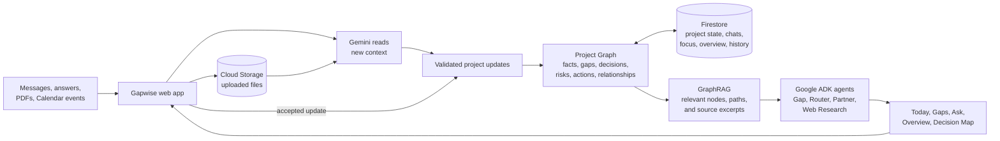
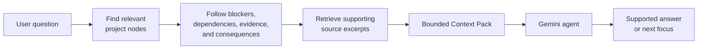
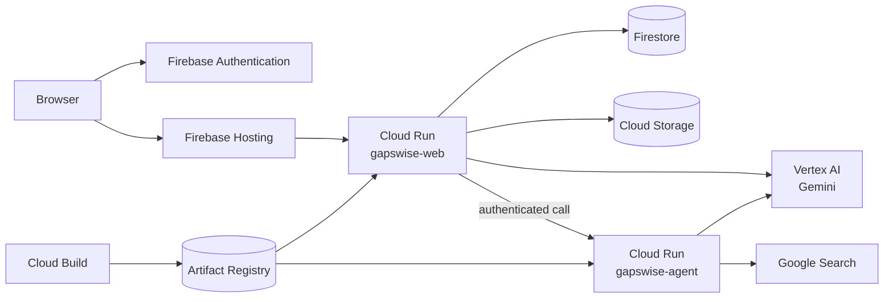

# Gapwise

Gapwise keeps a project's facts, decisions, risks, and open questions connected. It then shows which missing answer or unresolved decision is most useful to address next.

**Live app:** [gapwise.web.app](https://gapwise.web.app)

## The problem

Project context is usually split across notes, documents, meetings, and chat. A deadline may be in one file, a blocker in another, and the decision that connects them may never be written down. A normal task list does not explain what is missing or what that missing information affects.

Gapwise builds a persistent project graph from that context. It uses the graph to:

- Track goals, facts, evidence, constraints, risks, decisions, questions, and actions.
- Show the unresolved gap with the highest current value.
- Explain why a gap matters and what it blocks.
- Answer project questions with the relevant graph paths and source material.
- Keep suggested updates pending until the user accepts them.
- Preserve project history and open earlier project states.

## Try the guest demo

The public demo does not require a Google account.

1. Open [gapwise.web.app](https://gapwise.web.app).
2. Select **Try demo as guest**.
3. Select **Load demo**.
4. Open **Today** to see the current recommended gap and open decision.
5. Open **Workspace** and **Decision Map** to inspect the project state and its relationships.
6. Open **History** to see how the project changed.
7. Open **Ask** and ask up to three questions about the prepared project.

The guest workspace is a deterministic neighborhood repair workshop project. Creating it does not call Gemini. Guest access is read-only, except for three bounded Ask messages. Guest Ask uses the saved demo context and cannot search the web or change project state.

Verified owner accounts receive the full workspace. Other Google accounts receive the same restricted public demo access as a guest.

## How it works



There are two main flows:

```text
Build project state
New context -> Gemini -> validated updates -> Project Graph -> Firestore

Use project state
Question or project change -> GraphRAG -> ADK agent -> answer or recommended gap
```

Gemini does not write arbitrary objects to Firestore. Context processing returns typed updates. Gapwise validates node types, statuses, references, and relationship types before applying them. Ask suggestions stay separate from project state until the user accepts them.

## Project Graph and GraphRAG

### Building the graph

Each useful piece of context becomes a typed node, such as a fact, decision, risk, constraint, unknown, or action. Relationships record how the nodes connect. Examples include `informs`, `depends_on`, `blocks`, `affects`, `supports`, `resolves`, and `satisfies`.

Every node keeps references to the source that produced it. Reconciliation checks new updates against the existing graph so that a paraphrased question does not automatically become a second open gap.

### Retrieving context

GraphRAG starts with the nodes most relevant to a request, follows useful graph relationships, and retrieves the supporting source excerpts. The resulting Context Pack is small enough to reason over without sending the complete project history on every request.



This matters when the closest text is not the most useful information. For example, a pricing decision may be important, but an unresolved cost question may block it. Graph traversal lets Gapwise recommend the cost question first and retain the path back to the pricing decision.

## Google ADK agents

Gapwise uses four ADK roles. They share structured project context but have separate responsibilities.

| Agent | Responsibility |
| --- | --- |
| Gap Agent | Evaluates unresolved gaps and selects the one with the strongest decision value. |
| Ask Router | Chooses saved project context, graph reasoning, or external web research for an Ask request. |
| Partner Agent | Explains project state, compares options, and returns project-aware answers or pending suggestions. |
| Web Research Agent | Uses Google Search when current external evidence is required and returns cited results. |

The public demo uses a restricted Partner profile. It has a fixed output limit, no tools, no routing, no web research, and no project mutations.

## What runs on Google Cloud

| Service | Use in Gapwise |
| --- | --- |
| Vertex AI | Runs Gemini for context interpretation and agent reasoning. |
| Cloud Run | Hosts the Next.js web service and the private Python ADK service. |
| Firestore | Stores projects, graph nodes and edges, chats, answers, assessments, public-demo usage, and history snapshots. |
| Cloud Storage | Stores uploaded PDFs and documents. |
| Cloud Build | Builds both containers and deploys them to Cloud Run. |
| Artifact Registry | Stores the web and agent container images. |
| Firebase Authentication | Provides Google and anonymous guest sign-in. |
| Firebase Hosting | Serves `gapwise.web.app` and forwards app requests to the web Cloud Run service. |
| Google Search | Supplies current external evidence to the Web Research Agent. |
| Google Calendar | Optionally supplies read-only events that are relevant to a project goal. |

## Run locally

The standard local setup does not require Docker. The web service runs with Node.js and the ADK service runs with `uv`.

### Prerequisites

- Node.js 24 and npm
- Python 3.11 to 3.13
- [`uv`](https://docs.astral.sh/uv/getting-started/installation/)
- [Google Cloud CLI](https://cloud.google.com/sdk/docs/install)
- Bash with `curl` and `setsid` available (for `npm run dev:ai`)
- A Google Cloud project with billing enabled

### 1. Clone and install

```bash
git clone https://github.com/gapwise-assistant/gapwise-web.git
cd gapwise-web
npm ci
uv sync --directory agent-service
```

### 2. Prepare Google Cloud

Set a project and bucket name for this shell:

```bash
export GOOGLE_CLOUD_PROJECT="your-project-id"
export GAPWISE_UPLOAD_BUCKET="your-project-id-gapwise-context"
gcloud config set project "$GOOGLE_CLOUD_PROJECT"
```

Enable the required APIs:

```bash
gcloud services enable \
  aiplatform.googleapis.com \
  firestore.googleapis.com \
  storage.googleapis.com
```

Create the default Firestore database once, if the project does not already have one:

```bash
gcloud firestore databases create \
  --database='(default)' \
  --location=us-central1 \
  --type=firestore-native
```

Create a private upload bucket once:

```bash
gcloud storage buckets create "gs://$GAPWISE_UPLOAD_BUCKET" \
  --location=us-central1 \
  --uniform-bucket-level-access
```

### 3. Authenticate local services

```bash
gcloud auth login
gcloud auth application-default login
gcloud auth application-default set-quota-project "$GOOGLE_CLOUD_PROJECT"
```

The Next.js server and the Python service use Application Default Credentials for Vertex AI, Firestore, and Cloud Storage. Do not download a service-account key for local development.

### 4. Configure the environment

```bash
cp .env.example .env.local
cp agent-service/.env.example agent-service/.env
```

Set these values in `.env.local`:

```dotenv
GAPSWISE_DEMO_MODE=false
USE_FIRESTORE=true
GOOGLE_CLOUD_PROJECT=your-project-id
GOOGLE_CLOUD_LOCATION=global
GOOGLE_GENAI_USE_VERTEXAI=true
GEMINI_MODEL=gemini-3.5-flash-lite
FIRESTORE_DATABASE_ID=(default)
CLOUD_STORAGE_BUCKET=your-project-id-gapwise-context
GAPSWISE_AGENT_URL=http://127.0.0.1:8080
GAPSWISE_PUBLIC_WEB_URL=http://localhost:3000
GAPSWISE_AGENT_AUTH=false
```

Set the same project, location, and model in `agent-service/.env`:

```dotenv
GOOGLE_GENAI_USE_VERTEXAI=true
GOOGLE_CLOUD_PROJECT=your-project-id
GOOGLE_CLOUD_LOCATION=global
GEMINI_MODEL=gemini-3.5-flash-lite
GEMINI_EVAL_MODEL=gemini-3.5-flash-lite
GAPSWISE_APP_URL=http://localhost:3000
```

Firebase browser credentials are not required on localhost. Development requests use the local `demo-user` identity. Google Calendar is optional; its OAuth values can remain unset unless the integration is being tested.

### 5. Start both services

Pass the project and bucket to the startup script so both processes use the same configuration:

```bash
GOOGLE_CLOUD_PROJECT="$GOOGLE_CLOUD_PROJECT" \
CLOUD_STORAGE_BUCKET="$GAPWISE_UPLOAD_BUCKET" \
npm run dev:ai
```

The command starts:

- Web app: `http://localhost:3000`
- ADK service: `http://127.0.0.1:8080`

It checks ADC and the configured Gemini model before starting. It also creates a temporary internal secret shared by the two local processes. Press `Ctrl+C` to stop both services.

### 6. Verify the build

```bash
npm run typecheck
npm test
npm run build
```

Optional live storage checks:

```bash
npm run test:google:firestore
npm run test:google:storage
```

These two npm scripts intentionally target the official `gapwise-505217`
project, `(default)` Firestore database, and `gapwise-505217-context` bucket;
their package-script environment assignments override shell values. Run them
only after confirming that those are the intended development resources. For
a fork, do not assume that exporting different values changes these scripts.

The application uses live Google Cloud services in this mode, so Gemini and storage operations can incur charges.

## Deploy to Google Cloud

The checked-in deployment builds two containers remotely and deploys them as:

- `gapswise-web`, a public Cloud Run service for the product and APIs
- `gapswise-agent`, a private Cloud Run service for Google ADK

Local Docker is not required. Cloud Build reads [`Dockerfile`](./Dockerfile) and [`agent-service/Dockerfile`](./agent-service/Dockerfile), then stores the resulting images in Artifact Registry.

### Deployment layout



### Existing Gapwise project

The official project already has its APIs, Firestore database, bucket, service accounts, Firebase app, and secrets. From the repository root, submit the build with the public Firebase values and Google OAuth client ID:

```bash
gcloud builds submit . \
  --project=gapwise-505217 \
  --config=cloudbuild.yaml \
  --substitutions=_NEXT_PUBLIC_FIREBASE_API_KEY='...',_NEXT_PUBLIC_FIREBASE_AUTH_DOMAIN='gapwise-505217.firebaseapp.com',_NEXT_PUBLIC_FIREBASE_PROJECT_ID='gapwise-505217',_NEXT_PUBLIC_FIREBASE_STORAGE_BUCKET='gapwise-505217.firebasestorage.app',_NEXT_PUBLIC_FIREBASE_MESSAGING_SENDER_ID='...',_NEXT_PUBLIC_FIREBASE_APP_ID='...',_GOOGLE_OAUTH_CLIENT_ID='...'
```

The App Check site key is optional in the current deployment. Server enforcement is disabled in `cloudbuild.yaml`. If App Check is enabled later, pass `_NEXT_PUBLIC_FIREBASE_APPCHECK_SITE_KEY` and set `FIREBASE_APPCHECK_ENABLED=true` together.

Deploy Firebase Hosting only on the first deployment or when [`firebase.json`](./firebase.json) changes:

```bash
npx firebase-tools deploy --only hosting --project=gapwise-505217
```

### Deploying a fork

The checked-in `cloudbuild.yaml`, `.firebaserc`, and `firebase.json` contain values for the official deployment. A fork needs its own resources before the build is submitted.

1. Enable Cloud Build, Cloud Run, Artifact Registry, Vertex AI, Firestore, Cloud Storage, Secret Manager, and Firebase services.
2. Create a Native-mode `(default)` Firestore database and a private upload bucket.
3. Create the `cloud-run-source-deploy` Docker repository in `us-central1`.
4. Create `gapswise-web-runtime` and `gapswise-agent-runtime` service accounts.
5. Grant the web runtime Firestore User, Vertex AI User, and bucket-level Storage Object Admin access.
6. Grant the agent runtime Vertex AI User access.
7. Grant the Cloud Build service account Cloud Run Admin and Artifact Registry Writer. Grant it Service Account User on both runtime service accounts.
8. Create `gapswise-internal-api-secret` and `gapswise-google-oauth-client-secret` in Secret Manager. Grant the required runtime accounts Secret Accessor on those secrets.
9. Create a Firebase Web App. Enable Google and Anonymous providers in Firebase Authentication. Add the deployed domains to Authorized domains.
10. Replace the project-specific Cloud Run URLs, bucket, owner email, and public URL in `cloudbuild.yaml`. Replace the project and Hosting site in `.firebaserc` and `firebase.json`.
11. Supply the fork's Firebase web configuration and OAuth client ID through the build substitutions shown above.
12. Submit the build, then grant `roles/run.invoker` on `gapswise-agent` to the web runtime service account.
13. Query the two Cloud Run service URLs, update `_WEB_URL` and `_AGENT_URL`, and submit once more so both services have their final internal URLs.
14. Deploy Firebase Hosting.

Production values come from Cloud Build substitutions, Cloud Run environment variables, workload identity, and Secret Manager. Production does not read `.env.local`, `agent-service/.env`, downloaded OAuth credentials, or service-account JSON files.

## Repository layout

```text
src/                    Next.js product, APIs, graph, retrieval, and persistence
agent-service/          Python Google ADK agents and runtime
scripts/                Local startup, smoke tests, and evaluations
docs/                   Evaluation notes and walkthroughs
Dockerfile              Web Cloud Run image
agent-service/Dockerfile
cloudbuild.yaml         Remote build and Cloud Run deployment
firebase.json           Firebase Hosting rewrite
```

## Security boundaries

- Production routes verify Firebase ID tokens on the server.
- Full access is limited to verified emails listed in `GAPSWISE_FULL_ACCESS_EMAILS`.
- Guest and other external accounts can only load their registered public demo and use the bounded Ask allowance.
- The public demo cannot mutate project state or use web research.
- The ADK Cloud Run service is private and only the web runtime can invoke it.
- Uploaded files use a private Cloud Storage bucket.
- Internal Context Pack calls require a server-only shared secret.
- Calendar access is read-only.
- Ask suggestions do not become project facts until the user accepts them.
