# Gapwise

**Find the missing information that unlocks the next decision.**

Projects rarely fail because information does not exist. They fail because facts, decisions, risks, and unanswered questions are scattered across messages, documents, and conversations. The next important gap is easy to miss.

Gapwise turns that fragmented context into persistent project understanding. It connects what is known, what is unresolved, and what depends on what—then recommends the highest-value issue to address next.

## Value proposition

Gapwise helps a user:

- Build a living project graph from messages, PDFs, answers, and decisions.
- Find gaps that block important decisions instead of generating a generic task list.
- Retrieve relevant facts, relationships, and sources with GraphRAG before Gemini reasons.
- Ask project-aware questions and research current information when external evidence is needed.
- Keep AI suggestions separate from project truth until the user confirms them.
- Revisit historical project states and create an independent project from an earlier moment.

## Demo

The clearest walkthrough is the **Harbor Pilot History Demo**, a late-stage customer-support pilot with uploaded requirements, Ask conversations, accepted and dismissed suggestions, decisions, unresolved risks, and historical snapshots.

1. Start Gapwise locally with live AI using the instructions below.
2. Open the developer demo menu and select **Create fresh Harbor history demo**.
3. Open **Today** to see the current recommended focus and the evidence behind it.
4. Open **Decision Map** to inspect decisions, gaps, dependencies, and supporting evidence.
5. Open **Ask** to see project-aware conversations and user-confirmed project updates.
6. Open **History**, select **View this moment**, and inspect what the project knew then.
7. Select **Create project from this moment** to branch an earlier state without changing the original project.

The demo uses live Gemini calls and uploads generated demonstration PDFs to Cloud Storage. Creation can take several minutes.

## Architecture

Gapwise turns unstructured project context into structured, persistent project understanding. Gemini interprets new information, structured project updates modify the project graph, GraphRAG retrieves the relevant reasoning context, and Gemini uses that context to identify gaps, recommend focus, and answer project questions.

```mermaid
flowchart LR

    USER["User<br/>messages · PDFs · answers"]

    FILES[("Cloud Storage<br/>uploaded PDFs and documents")]

    GEMINI_CONTEXT["Gemini<br/>reads new information"]

    UPDATES["Structured project updates<br/>facts · decisions · gaps<br/>risks · relationships"]

    GRAPH["Project Graph<br/>connected project knowledge"]

    FIRESTORE[("Firestore<br/>graph · chats · answers<br/>focus · history")]

    RAG["GraphRAG<br/>finds relevant facts,<br/>connections and sources"]

    GEMINI_REASONING["Gemini<br/>reasons using retrieved context"]

    RESULT["Most important gap<br/>Recommended focus<br/>Helpful answer<br/>Project overview"]

    USER --> FILES
    USER --> GEMINI_CONTEXT
    FILES --> GEMINI_CONTEXT

    GEMINI_CONTEXT --> UPDATES
    UPDATES --> GRAPH
    GRAPH <--> FIRESTORE

    FIRESTORE --> RAG
    RAG --> GEMINI_REASONING
    GEMINI_REASONING --> RESULT
    RESULT --> USER

    RESULT -->|User confirms new information| UPDATES

    classDef userNode fill:#F8FAFC,stroke:#475569,stroke-width:2px,color:#0F172A
    classDef cloudNode fill:#E8F0FE,stroke:#4285F4,stroke-width:2px,color:#174EA6
    classDef geminiNode fill:#E6F4EA,stroke:#34A853,stroke-width:2px,color:#137333
    classDef gapwiseNode fill:#F3E8FF,stroke:#8B5CF6,stroke-width:2px,color:#5B21B6
    classDef graphNode fill:#FFF4D6,stroke:#F9AB00,stroke-width:3px,color:#6B4500
    classDef resultNode fill:#FCE8E6,stroke:#EA4335,stroke-width:2px,color:#A50E0E

    class USER userNode
    class FILES,FIRESTORE cloudNode
    class GEMINI_CONTEXT,GEMINI_REASONING geminiNode
    class UPDATES,RAG gapwiseNode
    class GRAPH graphNode
    class RESULT resultNode
```



The two core flows are:

```text
Build understanding
User context → Gemini → structured project updates → Project Graph → Firestore

Reason over the project
Project Graph → GraphRAG → Gemini → gap, focus, answer, or overview
```

Infrastructure responsibilities:

- **Cloud Storage:** uploaded PDFs and documents.
- **Firestore:** project graphs, Ask conversations, answers, assessments, and historical snapshots.
- **Gemini on Vertex AI:** structured context interpretation, gap analysis, focus assessment, project summaries, answers, and web-research synthesis.
- **GraphRAG:** retrieves relevant nodes, relationship paths, and supporting sources before reasoning.
- **Structured project updates:** validated changes applied to persistent project understanding.

## GraphRAG

GraphRAG combines text retrieval with the Project Graph. Text retrieval finds information that resembles the user's question; graph traversal adds information that matters because it is connected through a decision, dependency, blocker, or consequence.

### How the graph is built

When the user adds a message, answer, or document:

1. Gemini reads the new context and returns structured project updates.
2. Gapwise validates those updates against its project schema.
3. New information is reconciled with existing project knowledge to avoid duplicate questions and decisions.
4. Gapwise stores typed nodes such as goals, facts, evidence, decisions, risks, unknowns, constraints, and next actions.
5. It stores supported relationships such as `informs`, `depends_on`, `blocks`, `affects`, `resolves`, and `supports`.
6. Every node retains references to the source material from which it was derived.
7. The resulting graph is persisted in Firestore; uploaded files remain in Cloud Storage.

Gemini proposes structured changes, but it does not freely rewrite the database. Gapwise validates references, statuses, and relationship types before applying an update. Suggestions produced in Ask remain pending until the user explicitly adds them.

### How retrieval works

For a question such as:

> Could the unresolved deletion requirement delay the launch?

Gapwise retrieves reasoning context in four stages:

```text
1. Find relevant graph nodes
   deletion requirement · security approval · launch goal

2. Follow meaningful relationships
   deletion requirement → security approval → procurement → launch

3. Retrieve supporting source excerpts
   security requirements · engineering review · pilot brief

4. Give the bounded context to Gemini
   relevant nodes + relationship paths + source evidence
```

The default retrieval stays small: a few strong starting nodes, nearby relationships, and the source excerpts needed to support them. It does not send the complete project to Gemini for every request.

The same retrieval layer supports different tasks:

- **Ask:** answers questions using project-specific evidence and relationships.
- **Gap analysis:** finds unresolved information that blocks an important decision.
- **Focus:** identifies the actionable issue with the greatest downstream value.
- **Impact analysis:** follows relationships to explain what a change could affect.
- **Decision support:** retrieves the evidence, constraints, and open prerequisites surrounding a decision.

### Why use GraphRAG

Plain text retrieval is useful for direct facts, but it can miss information whose importance comes from a relationship rather than similar wording. GraphRAG gives Gapwise several advantages:

- **Dependency awareness:** it can distinguish an important decision from the prerequisite that must be addressed first.
- **Consequence tracing:** it can follow how a risk or uncertainty affects downstream decisions and goals.
- **Evidence-backed answers:** graph nodes lead back to the documents and messages that support them.
- **Smaller prompts:** Gemini receives focused reasoning context instead of the entire project history.
- **Persistent understanding:** decisions and resolved questions remain part of the project state across conversations.
- **Shared reasoning:** Ask, Today, Focus, and gap analysis can work from the same project structure.
- **Inspectability:** users can see the underlying decisions, gaps, evidence, and relationships in Decision Map.

Graph relationships are treated as structured project context, not unquestionable truth. Gapwise distinguishes recorded facts from model inference, preserves provenance, and requires user confirmation before an Ask suggestion becomes project knowledge.

## Run locally

### Prerequisites

- Node.js 24 and npm
- Python 3.11–3.13
- [`uv`](https://docs.astral.sh/uv/getting-started/installation/)
- [Google Cloud CLI](https://cloud.google.com/sdk/docs/install)
- A Google Cloud project with billing, Vertex AI, Firestore, and Cloud Storage enabled

Local live development uses Firestore as the durable database. Browser storage and the JSON mock provider are not authoritative project storage.

### 1. Install dependencies

```bash
git clone <repository-url>
cd gapwise

npm install
uv sync --directory agent-service
```

### 2. Authenticate with Google Cloud

```bash
gcloud auth login
gcloud auth application-default login
gcloud config set project YOUR_GOOGLE_CLOUD_PROJECT
```

The application uses Application Default Credentials for Vertex AI, Firestore, and Cloud Storage.

### 3. Configure the application

```bash
cp .env.example .env.local
cp agent-service/.env.example agent-service/.env
```

At minimum, configure these values in `.env.local`:

```dotenv
GAPSWISE_DEMO_MODE=false
USE_FIRESTORE=true
GOOGLE_CLOUD_PROJECT=your-google-cloud-project
GOOGLE_CLOUD_LOCATION=global
GOOGLE_GENAI_USE_VERTEXAI=true
FIRESTORE_DATABASE_ID=(default)
CLOUD_STORAGE_BUCKET=your-private-upload-bucket
GAPSWISE_AGENT_URL=http://127.0.0.1:8080
```

Set the same Google Cloud project and supported Gemini model in `agent-service/.env`. Keep secrets out of source control.

Firebase browser configuration is required for deployed authentication. Localhost development uses the development-only `demo-user` identity.

### 4. Start the web and agent services

```bash
npm run dev:ai
```

This command starts:

- Gapwise at `http://localhost:3000`
- The Google ADK agent service at `http://127.0.0.1:8080`

It validates Application Default Credentials and the configured Gemini model before starting. Press `Ctrl+C` to stop both services.

### 5. Verify the project

```bash
npm run typecheck
npm test
npm run build
```

Google Cloud connectivity can be checked independently:

```bash
npm run test:google:firestore
npm run test:google:storage
```

Live Gemini calls and Cloud Storage operations may incur Google Cloud charges.

## Deploy to Google Cloud

`cloudbuild.yaml` builds and deploys two Cloud Run services:

- `gapswise-web`: the web application and project APIs
- `gapswise-agent`: the private Google ADK agent service

Before deploying:

1. Create the Cloud Run runtime service accounts referenced in `cloudbuild.yaml`.
2. Grant the web service access to Firestore, Cloud Storage, Vertex AI, and permission to invoke the private agent service.
3. Grant the agent service access to Vertex AI and permission to call the web service's internal Context Pack endpoint.
4. Create Secret Manager values for `gapswise-internal-api-secret` and `gapswise-google-oauth-client-secret`.
5. Configure Firebase Authentication and create a Firebase Web App.
6. Enable the APIs used by Cloud Build, Cloud Run, Artifact Registry, Vertex AI, Firestore, Cloud Storage, and Secret Manager.

The checked-in pipeline currently targets the `gapwise-505217` deployment. Deploy it from the repository root with:

```bash
gcloud builds submit . \
  --project=gapwise-505217 \
  --config=cloudbuild.yaml \
  --substitutions=_NEXT_PUBLIC_FIREBASE_API_KEY='...',_NEXT_PUBLIC_FIREBASE_AUTH_DOMAIN='gapwise-505217.firebaseapp.com',_NEXT_PUBLIC_FIREBASE_PROJECT_ID='gapwise-505217',_NEXT_PUBLIC_FIREBASE_STORAGE_BUCKET='gapwise-505217.firebasestorage.app',_NEXT_PUBLIC_FIREBASE_MESSAGING_SENDER_ID='...',_NEXT_PUBLIC_FIREBASE_APP_ID='...',_NEXT_PUBLIC_FIREBASE_APPCHECK_SITE_KEY='...',_GOOGLE_OAUTH_CLIENT_ID='...'
```

Public Firebase configuration is supplied through build substitutions. Internal API and OAuth secrets are attached to Cloud Run from Secret Manager. Production does not read `.env.local`, `agent-service/.env`, downloaded OAuth credentials, or service-account JSON files. To deploy into another project, first update the project-specific bucket, service accounts, URLs, and Firebase configuration in `cloudbuild.yaml`.

## Repository structure

```text
src/                    Next.js product, APIs, graph, retrieval, and persistence
agent-service/          Python Google ADK agents and runtime
scripts/                Local startup, scenarios, smoke tests, and evaluations
docs/                   Evaluation and walkthrough documentation
cloudbuild.yaml         Google Cloud build and deployment pipeline
```

## Security boundaries

- Project data is scoped to the authenticated Firebase user.
- Uploaded documents are stored in a private Cloud Storage bucket.
- The ADK service is private in production and invoked by the web service.
- Internal web-to-agent calls use service identity; agent-to-web Context Pack calls also require a shared secret.
- AI-proposed project updates remain pending until the user explicitly adds them.
- Calendar access is read-only. Gmail, Drive, and email write actions are not performed silently.
